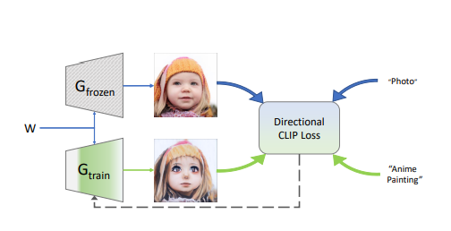
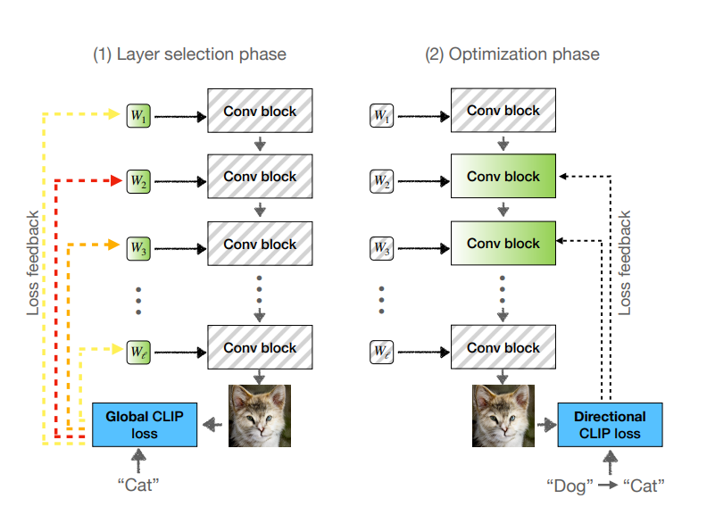
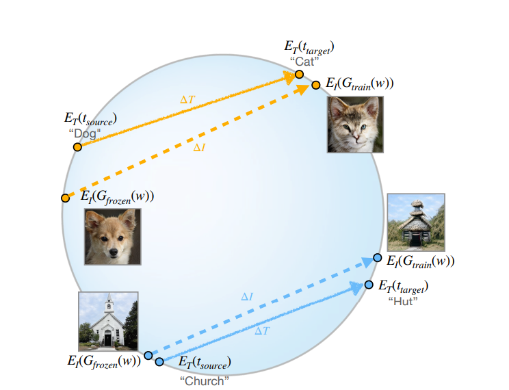
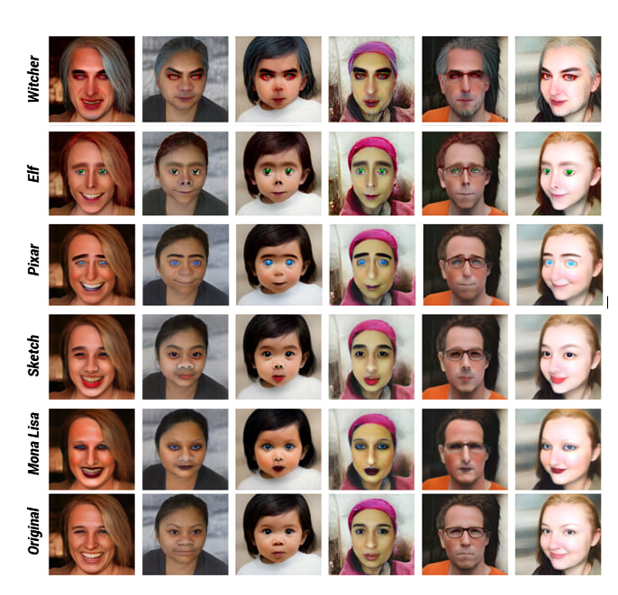

# Project: CLIP-Guided Domain Adaptation of Image Generators

## Project Overview

This project aims to re-implement the StyleGAN-NADA paper (https://stylegan-nada.github.io/) – a task focused on domain adaptation of a pre-trained GAN. The main objective is to learn to generate images from a specific domain based on a given text prompt.
The project is implemented using Jupyter Notebooks for ease of training and inference.

## Capabilities
* **StyleGAN Domain Adaptation:** Modify the StyleGAN generation style according to a specified text prompt (e.g., "transform faces into Witcher").
* **Global CLIP for Semantic Control:** Apply a global CLIP-based loss function for adaptive layer unfreezing.
* **Directional CLIP for Semantic Control:** Apply a CLIP-based loss function for effective control of the adaptation process using text descriptions.
* **Real Image Inversion:** Ability to find a latent vector for a real image, which allows applying the adapted generator to existing photographs.

### Problem Statement

Traditional generative models, such as GANs, typically require extensive datasets for effective training. This requirement significantly limits their applicability in scenarios where data is insufficient or entirely absent (e.g., for very specific artistic styles or fictional scenes). Naive approaches that attempt to maximize some CLIP-based classification score often lead to undesirable "adversarial" solutions. These solutions deceive the classifier by adding pixel-level perturbations without preserving image diversity, making such loss functions unsuitable for generator training.

### Theoretical Foundations

Instead of directly deceiving the classifier, this approach utilizes **Directional CLIP Loss** by encoding the difference between domains as a textual direction in the CLIP embedding space. A new loss function and training architecture are proposed, employing two generators:

* One generator (`G_frozen`) remains **frozen**, intended to provide samples from the source domain.
* The second generator (`G_train`) is optimized to create images that differ from the original source only in the text-described inter-domain direction within the CLIP space.

#### Layer Unfreezing

The StyleGAN architecture consists of a Mapping Network (transforming a random `z` vector into a `w` vector), affine transformations (mapping `w` to the `w+` space), and generator blocks. A critical aspect of this method is the partial unfreezing of layers. Initially, StyleGAN's Mapping Network, affine transformations, and all `toRGB` layers are frozen. To determine which specific layers to unfreeze, a latent vector in the `W+` space is initialized and made trainable, while the entire generator remains frozen. After several training iterations using a **Global Loss function (`Lglobal`)** — which is defined as the cosine distance in CLIP space between the generated image `G(w)` and the target class text description `ttarget` — changes in the latent vectors are observed. The layers corresponding to the most significantly changed latent vectors are then unfrozen.

#### Training Process

During the main training phase, the latent vector is made non-trainable (using `W+` space vectors yields better results), and new latent vectors are randomly generated within the training loop. Only the `G_train` generator remains trainable. The training objective includes several loss functions: the **Directional CLIP Loss (`Ldirection`)**, Identity (ID) loss, and L2 loss, each weighted by corresponding coefficients. Directional CLIP Loss quantifies the difference between target and source texts (`ΔT`) and the difference between images generated by the trainable and frozen generators (`ΔI`), guiding the adaptation's direction.

The method demonstrates a wide range of out-of-domain adaptations, including changes in style, texture, and significant modifications to form, from realistic to fantastical. These results are achieved through a simple text interface and training processes completed in a matter of minutes.

## Launch in Google Colab

**Training/Model adaptation (`train.ipynb`)**

**Inference/Image Generation (`inference.ipynb')** translate into English

## Results
Examples of results obtained on FFHQ for 5 different prompts (Elf, Witcher, Pixar, Mona Lisa, and Sketch).

## License
MIT License